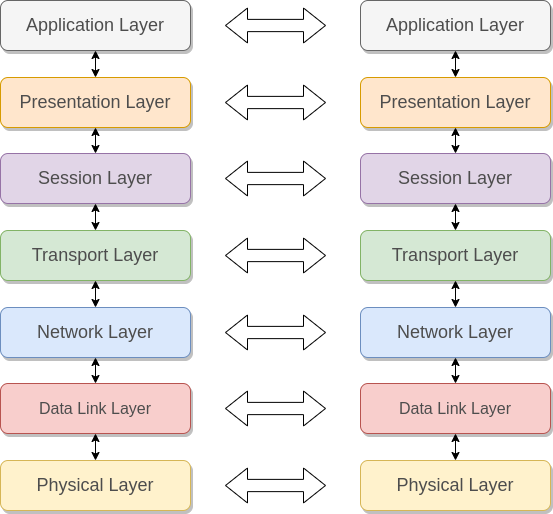
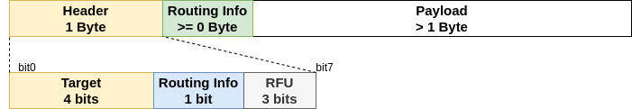

# ECGP 外部通信通用协议

* [English Version](./README.md)

ECGP (External Communication Generic Protocol) 是一款开源的，通用的有线通信协议。
* 支持UART，SPI等串行通信接口。
* 可选的TMDA和CSMA模式。
* 单端口可配置的顺序接收模式。
* 灵活可裁剪，资源消耗少。
  
## 支持的软件平台
* Linux

* FreeRTOS

* RT-Thread

* UCOS

* Zephyr

* Mynewt

  ...

## 版本历史
* release/v1.0 

## 安装环境依赖
* Ubuntu
    > sudo apt-get install lcov
    > sudo apt-get install libc6:i386
    > sudo apt-get install lib32ncurses5
    > sudo apt-get install lib32z1

## 协议介绍

ECGP遵循ISO七层网络模型。

* 物理层 Physical Layer
  * 数据收发的物理载体，通常是UART，SPI等串行接口。
* 数据链路层 Data Link Layer
  * 控制物理接口收发数据。
  * 进行数据错误检测。
* 网络层 Network Layer
  * 分配和管理2字节通信地址。
  * 选择使用具体哪种物理接口进行数据收发。
* 传输层 Tansport Layer
  * 负责重传和数据应答。
  * 进行流量控制。
  * 拆包和组包。
* 会话层 Session Layer
  * 负责建立逻辑连接供上层调用。
* 表示层 Presentation Layer
* 应用层 Application LAyer
  * 具体应用程序。
  
  

### 1. 地址类型

ECGP具有两种地址类型，三种长度, 由地址最高 字节的最高两个bit区分。

| 地址类型 | 十进制 | 长度（字节) | 用途     |
| -------- | ------ | ----------- | -------- |
| 0b'00    | 0      | 1           | 通信地址 |
| 0b'01    | 1      | 2           | 通信地址 |
| 0b'10    | 2      | 6           | 设备地址 |
| 0b'11    | 3      | 1           | 保留     |

* 设备地址用以区分不同设备，每个设备应该使用一个独一无二的值作为地址。
* 通信地址由协议栈动态分配。

### 2. Data Link Layer

#### 2.1 数据帧格式

图1.1 数据链路层数据帧

* 帧头和帧尾各加一个字节（0x3c），代表数据帧的开始和结束。
* 数据帧中有一个特殊字符 0x5c
  * 若数据帧中存在0x3c，需要在前面多发送一个0x5c，代表这个0x3c并没有特殊意义。
  * 若数据帧中存在0x5c, 需要连续发送两个0x5c, 代表后面的0x5c是正常数据帧。
  * 0x5c 0x03 ~ 0x5c 0x3b 代表有连续0x03 ~ 0x3b个0x00被压缩发送。
  * 0x5c 0xc3 ~ 0x5c 0xfb 代表有连续0x03 ~ 0x3b个0xff被压缩发送。
* 接收方需要根据地址类型，计算payload的长度，计算出CRC，来验证这个数据帧是否正确。
* CRC 计算方式：
  * TODO

#### 2.2 协议控制包

* TODO

### 3. Network Layer

#### 3.1 数据帧格式

图1.2 网络层数据帧

* 仅Target为0x01的时候，本层才需要处理这个PDU，否则传到上层处理。
* Routing Info表示后面有路由信息。

#### 3.2 协议控制包

##### 3.2.1. New Device Inquiry

##### 3.2.2. Provision Request

##### 3.2.3. Provision Response

### 4. Transport Layer

